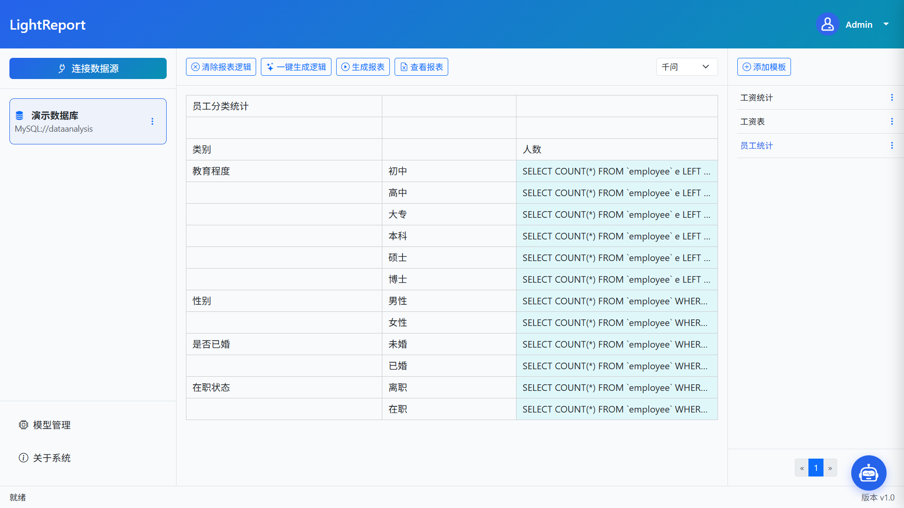

# LightReport

LightReport 是一款**轻量级、智能化**的报表工具，基于大语言模型（LLM）驱动。通过自然语言交互，自动理解数据库语义并生成 SQL 查询，快速产出交互式可视化报表。

无需复杂配置，支持 Excel / 数据库对接，实现**简单且高效**的报表制作。



## ✨ 核心特性

- **📄 Excel 模板导入**  
  支持从简单到复杂的各类报表模板，完美兼容单元格合并、计算公式等复杂定义。

- **💬 自然语言交互**  
  自动解析用户提问的语义与目标，准确识别关键信息与上下文关系。支持复杂条件与多维度报表逻辑。

- **⚡ 一键生成逻辑**  
  智能识别报表模板的数据特征，一键生成完整报表逻辑，同时支持报表逻辑的自定义与二次编辑。

- **🧠 多 LLM 支持**  
  已集成 DeepSeek、Kimi、Qwen 等主流大语言模型，可灵活切换。

## 🚀 快速开始

### 前置条件

- Python 3.9 及以上 → [下载](https://www.python.org/downloads/)
- MySQL 5.7 及以上 → [下载](https://downloads.mysql.com/archives/community/)

### 克隆项目

```bash
git clone https://github.com/isuixiang/ai-light-report.git
cd ai-light-report
```

### 安装依赖

> **建议**：创建并激活虚拟环境后再执行安装。

```bash
pip install -r requirements.txt
```

### 数据库初始化

#### 1. 项目数据库

```bash
# 在 MySQL 中创建数据库（名称自定）
# 然后导入初始化脚本
mysql -u your_user -p your_project_db < data/db/ailightreport.sql
```

#### 2. 演示数据库（可选）

```bash
mysql -u your_user -p your_demo_db < data/db/dataanalysis.sql
```

### 配置文件

复制示例配置并修改数据库连接信息：

```bash
cp example.env .env
```

编辑 `.env` 文件：

```env
# DB PARAMS
DB_HOST = "127.0.0.1"
DB_PORT = 3306
DB_NAME = "your_database_name"
DB_USER = "your_db_user"
DB_PASSWORD = "your_db_password"
```

### 启动服务

```bash
flask run
```

启动成功后，访问：  
👉 [http://127.0.0.1:5000](http://127.0.0.1:5000)

**默认登录账户**：`admin` / `123456`

## 📖 使用指南

1. **连接数据源**  
   支持 MySQL 和 SQLServer，以演示数据库为例创建数据源。

2. **配置技能（Skills）**  
   在已创建的数据源中添加技能，技能文件位于项目根目录下的 `data/skills`。

3. **添加大模型**  
   在“模型管理”中配置你所使用的 LLM 的 API Key（支持 DeepSeek、Kimi、Qwen 等）。

4. **添加报表模板**  
   上传或选择 Excel 模板（模板存放于 `data/excels`）。

## 🛠 技术栈

- **后端**：Flask
- **数据库**：MySQL
- **AI 模型**：DeepSeek / Kimi / Qwen 等
- **报表处理**：Excel 模板解析

## 🤝 参与贡献

欢迎提交 Issue 或 Pull Request。  
如果你有任何改进建议或新功能想法，也非常欢迎与我们交流。

## 📬 联系我们

- **QQ**：1029993198
- **邮箱**：[zyq55917@hotmail.com](mailto:zyq55917@hotmail.com)
- **Issues**：[GitHub Issues](https://github.com/isuixiang/ai-light-report/issues)

## 📄 开源许可

本项目基于 **Apache 2.0** 开源，详情请参阅 [LICENSE](LICENSE) 文件。
